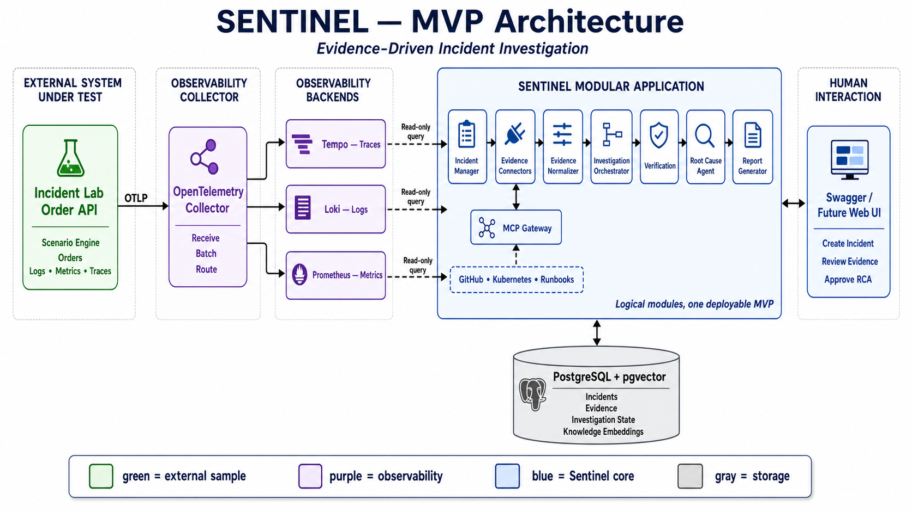

# Sentinel

Sentinel is a publicly viewable portfolio project demonstrating the design and implementation of an enterprise-grade agentic AI platform for autonomous production-incident investigation. It correlates evidence from observability and engineering systems, reconstructs incident timelines, and produces explainable root-cause analyses with confidence scores.

> Project status: early planning and architecture. The repository structure and interfaces described below are the intended direction, not a list of completed features.

The current implementation starting point is documented in the [Day 1 Implementation Plan](docs/day-1-plan.md).
The telemetry setup and Collector deployment model are documented in [Observability](docs/observability.md).
The PostgreSQL and pgvector local setup is documented in [Database](docs/database.md).
The Alertmanager-triggered, AI-assisted Loki/Tempo ingestion design is documented
in [AI-Assisted Telemetry Ingestion](docs/ingestion-system-design.md).
The complete MVP scope, architecture, delivery sequence, and acceptance criteria
are documented in the [MVP Technical Specification](docs/mvp-technical-specification.md).
The independently runnable fault-producing sample is documented in
[Incident Lab Order API](samples/IncidentLab.OrderApi/README.md).

When the API runs in the Development environment, interactive API documentation is available at `/swagger` and the OpenAPI document at `/openapi/v1.json`.

Run Sentinel API, Incident Lab Order API, the OpenTelemetry Collector, and
Grafana Tempo as separate containers:

```powershell
docker compose up --build -d
```

Sentinel is available at `http://localhost:5156` and the Incident Lab at
`http://localhost:5112`. Tempo's query API is available at
`http://localhost:3200`.

## Vision

Sentinel is designed to demonstrate production-grade approaches to agentic AI, retrieval-augmented generation (RAG), Model Context Protocol (MCP) integrations, distributed systems, observability, memory optimization, and software architecture.

## Planned capabilities

- Multi-agent incident investigation
- Root-cause analysis with confidence scores
- Evidence graphs and explainable conclusions
- Incident timeline reconstruction
- AI-generated postmortems
- Runbook recommendations
- Human-in-the-loop review and approvals

## MVP scope

The first release will prove one complete investigation workflow before expanding the platform:

1. Receive an alert for a deliberately faulty demo service.
2. Collect logs, metrics, traces, and recent deployment changes.
3. Normalize findings into typed, provenance-preserving evidence.
4. Build an incident timeline and evidence graph.
5. Rank root-cause hypotheses and explain each conclusion with citations.
6. Require human review before producing a final postmortem or recommending an action.

### MVP non-goals

- Autonomous production remediation
- Broad support for every observability or ticketing platform
- A separately deployed service for every logical component
- Self-learning agents or adaptive planning
- Compliance, capacity, cost, security, or chaos-engineering analysis

## Architecture

The MVP uses one modular application and one evidence-to-RCA workflow. Read-only connectors collect observability signals, targeted knowledge retrieval adds relevant operational context, and both inputs are normalized into traceable evidence before root-cause analysis. A human reviews the result before the postmortem is finalized.



### High-level components

- Incident API
- Investigation Orchestrator
- Read-only connectors for logs, metrics, traces, and deployments
- Knowledge retrieval for runbooks and previous incidents
- Evidence Normalizer and Store
- Root Cause Analysis Engine
- Human review and postmortem generation
- PostgreSQL with pgvector, plus optional object storage
- OpenTelemetry and an instrumented demo service

These are logical modules within a modular monolith, with explicit contracts and independently testable boundaries. Modules should become separately deployed services only when measured scaling, isolation, security, or ownership requirements justify the operational cost. The broader target architecture is retained in `DataFlow-Final.png` as a future-state reference, not an MVP implementation plan.

### Evidence contract

Agents exchange structured evidence rather than raw telemetry or unsupported conclusions. At minimum, each evidence object should contain:

| Field | Purpose |
| --- | --- |
| ID | Stable identifier used by hypotheses and reports |
| Source | Originating system and resource |
| Observed at | Event or observation timestamp |
| Claim | Concise statement supported by the artifact |
| Artifact reference | Link or immutable pointer to the underlying data |
| Reliability | Source-quality assessment, distinct from RCA confidence |
| Provenance | Agent, query, filters, and transformations that produced it |

Root-cause confidence must be derived from documented evidence and competing hypotheses. It should not be presented as a calibrated probability until evaluation data supports that interpretation.

## Memory strategy

Sentinel separates memory by scope and lifetime:

| Layer | Purpose |
| --- | --- |
| Working memory | State and evidence for the current incident |
| Shared memory | Fast coordination between agents through Redis |
| Long-term memory | Semantically searchable knowledge in a RAG/vector store |
| Archive memory | Raw logs, traces, and other durable investigation artifacts |

To keep agent context focused and costs predictable, the platform will use context compression, token budgets, lazy retrieval, and structured evidence objects instead of forwarding raw telemetry between agents.

## RAG and integrations

The Knowledge Agent will retrieve relevant context from runbooks, architecture decision records, architecture documentation, previous incidents, API documentation, and internal wikis.

MCP is the intended integration layer for systems such as:

- GitHub
- Kubernetes
- Prometheus
- Grafana and Loki
- OpenTelemetry
- Jira
- Slack
- PostgreSQL

## Proposed logical modules

These are intended code boundaries, not necessarily independent deployable services:

```text
Sentinel.API/             API gateway and external API
Sentinel.Orchestrator/    Incident workflow and agent coordination
Sentinel.AgentRuntime/    Multi-agent execution runtime
Sentinel.AgentSdk/        Contracts and tooling for specialized agents
Sentinel.Memory/          Working, shared, long-term, and archive memory
Sentinel.RAG/             Knowledge indexing and retrieval
Sentinel.MCP/             MCP gateway and protocol support
Sentinel.Connectors/      External-system integrations
Sentinel.Storage/         Persistence abstractions and implementations
Sentinel.UI/              Web interface
Sentinel.CLI/             Command-line interface
Sentinel.Samples/         Examples and demo incident scenarios
```

## Roadmap

| Timeline | Focus |
| --- | --- |
| Weeks 1-2 | Define the demo incident, acceptance criteria, threat model, evidence schema, architecture, and ADRs |
| Weeks 3-4 | Build the instrumented demo system, incident ingestion, Docker environment, and OpenTelemetry foundation |
| Weeks 5-6 | Add read-only telemetry and deployment connectors, evidence normalization, memory, and targeted RAG |
| Weeks 7-8 | Implement the agent contracts and a single end-to-end investigator with deterministic correlation |
| Weeks 9-10 | Add specialized agents, orchestration, hypothesis ranking, confidence rationale, and failure handling |
| Weeks 11-12 | Complete human review, postmortem generation, evaluation suite, UI, documentation, and reproducible demo |

## Design principles

- Evidence over intuition
- Specialized agents with clear responsibilities
- Memory and context efficiency
- Model-agnostic interfaces
- Open standards, especially MCP and OpenTelemetry
- Human oversight for consequential actions
- Production-first engineering
- Deterministic processing for collection and correlation where possible; LLM reasoning where it adds clear value
- Least-privilege, read-only access by default

## Reliability and safety

The investigation workflow must support timeouts, cancellation, retries, partial results, and idempotent re-execution. Every conclusion should be traceable to its evidence, model invocation, prompt version, and tool activity.

Telemetry, retrieved documents, and tool responses are untrusted input. Connectors must enforce authorization independently of agent instructions, defend against prompt injection, redact sensitive data, and maintain an auditable record of access. Any action that can change an external system remains behind an explicit human approval boundary.

## Success criteria

The MVP will be evaluated against a fixed collection of reproducible incident scenarios:

- Root cause appears in the ranked hypotheses and is supported by valid evidence.
- Evidence citations resolve to the correct source artifacts.
- The reconstructed timeline preserves event ordering and identifies relevant changes.
- Repeated runs produce materially consistent conclusions.
- Investigation latency and token/model cost stay within defined scenario budgets.
- Missing integrations and partial failures produce transparent degraded results, not fabricated evidence.

## Future enhancements

Potential extensions include Security, Cost Analysis, Capacity Planning, Compliance, and Chaos Engineering agents, along with adaptive planning, learning agents, and a plugin ecosystem.

## Contributions

This is a personal portfolio project. Unsolicited contributions are not currently accepted. Opening an issue or submitting a pull request does not grant permission to use any part of the project.

## License and permitted use

Copyright (c) 2026 Saman. All rights reserved.

This repository is publicly available solely for portfolio review, recruitment evaluation, and demonstration purposes.

No permission is granted to use, copy, modify, distribute, sublicense, sell, deploy, publish, or create derivative works from any portion of this project without the copyright owner's prior written consent.

Viewing and forking through functionality provided by GitHub remain subject to GitHub's Terms of Service. Rights provided by applicable law are not restricted.

For licensing or usage permission, contact the repository owner through their GitHub profile. See the [LICENSE](LICENSE) file for the complete terms.
