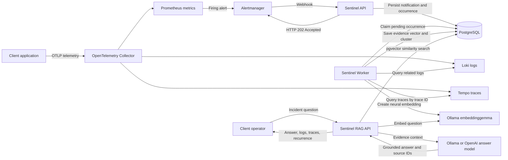

# Sentinel

Sentinel helps platform engineers, SREs, and application-support teams investigate
production incidents faster. It receives Prometheus alerts, automatically gathers
the related Loki logs and Tempo traces, groups recurring incidents by neural
similarity, and lets operators ask plain-language questions about what failed,
why it failed, and how often it has happened. The result is a searchable,
evidence-backed incident history that runs inside the client's environment.

> **MVP status:** Sentinel is an active prototype, not a production-ready
> platform. It is intended to run inside the client's environment so telemetry,
> incident evidence, embeddings, and model requests can remain under the
> client's control. The Docker Compose deployment in this repository is the
> reference environment for development and evaluation.

Sentinel is not currently offered as a hosted SaaS product. A client deployment
is responsible for its infrastructure, access controls, secrets, network policy,
backups, retention, model hosting, and operational support.

## What is implemented

- Alertmanager-compatible webhook ingestion in C# and ASP.NET Core.
- Durable storage of every webhook notification in PostgreSQL.
- Deduplication of repeated notifications into distinct alert occurrences.
- A separate C# worker that queries Loki and follows trace IDs into Tempo.
- Deterministic log and trace normalization with provenance.
- Neural incident embeddings through Ollama `embeddinggemma`.
- PostgreSQL similarity search through `pgvector`.
- Similar-incident clustering and recurrence counts.
- A separately deployed, read-only RAG API.
- Local answers through Ollama, with an optional OpenAI provider.
- A complete local observability stack: Grafana, Prometheus, Alertmanager,
  Loki, Tempo, and OpenTelemetry Collector.
- Incident Lab sample applications for generating reproducible telemetry.

Ingestion is deterministic and is **not an AI agent**. The LLM participates only
when the RAG API generates a natural-language answer from retrieved evidence.

## Client-managed deployment model

The intended MVP topology is:



The webhook path ends after durable persistence and returns `202 Accepted`;
log collection, trace collection, embedding, and clustering run asynchronously.
The RAG API is a separate read-only service and does not participate in alert
ingestion.

For a real client deployment, replace the included Incident Lab with the
client's application and point the OpenTelemetry, Prometheus, Loki, Tempo, and
Alertmanager configuration at the client's endpoints. The current MVP assumes
these systems are reachable from the Sentinel containers.

## Technology

- .NET 10 and ASP.NET Core
- Entity Framework Core and PostgreSQL 18
- `pgvector` with 768-dimensional embeddings
- Ollama `embeddinggemma` for neural embeddings
- Ollama `qwen3:8b` by default for answers
- Prometheus, Alertmanager, Loki, Tempo, Grafana, and OpenTelemetry
- Docker Compose for the reference deployment

## Prerequisites

- Docker Desktop with Linux containers
- Ollama running on the Docker host
- PowerShell for the commands below, or equivalent shell commands
- .NET SDK 10 only when building or testing outside Docker

Install the default local models:

```powershell
ollama pull embeddinggemma
ollama pull qwen3:8b
```

You can use another installed Ollama answer model:

```powershell
$env:OLLAMA_MODEL = "qwen3:1.7b"
```

The ingestion worker and RAG API must use the same embedding model and vector
dimensions. Existing vectors cannot be searched with a different embedding
model without re-embedding them.

## Run locally

Start the reference environment:

```powershell
docker compose up --build -d
```

Check service state:

```powershell
docker compose ps
```

The Telemetry Generator can automatically rotate through failure scenarios. To
keep traffic running without automated failures, set this before starting:

```powershell
$env:TELEMETRY_AUTOMATED_FAILURES_ENABLED = "false"
docker compose up --build -d
```

To pause all generated sample traffic without stopping Sentinel:

```powershell
docker compose stop telemetry-generator
```

Stop the environment while retaining Docker volumes:

```powershell
docker compose down
```

Do not add `-v` unless you intend to delete local PostgreSQL, Prometheus, Loki,
Tempo, and Grafana data.

## Local endpoints

| Component | URL | Purpose |
| --- | --- | --- |
| Sentinel API | `http://localhost:5156` | Alert intake and ingestion APIs |
| Sentinel RAG API | `http://localhost:5157` | Incident search and answers |
| Incident Lab Order API | `http://localhost:5112` | Fault-producing sample service |
| Telemetry Generator | `http://localhost:5113/status` | Sample traffic status |
| Grafana | `http://localhost:3000` | Metrics, logs, and traces |
| Prometheus | `http://localhost:9090` | Metrics and alert rules |
| Alertmanager | `http://localhost:9093` | Alert routing |
| Tempo | `http://localhost:3200` | Trace query API |
| Loki | `http://localhost:3100` | Log query API |
| PostgreSQL | `localhost:5433` | Sentinel persistence |

Local development credentials use `sentinel-local-dev-only` defaults. They are
not suitable for a shared or production client environment.

## Submit an alert

Alertmanager sends notifications to:

```text
POST http://localhost:5156/api/alerts/webhook
```

Example:

```powershell
$body = @{
    receiver = "sentinel"
    status = "firing"
    alerts = @(
        @{
            labels = @{
                alertname = "OrderApiHighLatency"
                service = "incidentlab-order-api"
                environment = "local"
            }
            annotations = @{
                summary = "Order API latency is high"
            }
            startsAt = (Get-Date).ToUniversalTime().ToString("o")
        }
    )
} | ConvertTo-Json -Depth 8

Invoke-RestMethod `
    -Method Post `
    -Uri "http://localhost:5156/api/alerts/webhook" `
    -ContentType "application/json" `
    -Body $body
```

The API durably stores the notification and returns `202 Accepted`. Loki, Tempo,
embedding, and clustering work continues asynchronously in `Sentinel.Worker`.

Repeated delivery of the same labels and Prometheus `startsAt` creates another
notification record but does not create another occurrence. A later distinct
occurrence can join an existing incident cluster when its neural evidence is
sufficiently similar.

## Query incident knowledge

Ask the read-only RAG API a question:

```powershell
$body = @{
    question = "What is the issue with the most recent 502 error?"
    service = "incidentlab-order-api"
    environment = "local"
    limit = 1
} | ConvertTo-Json

Invoke-RestMethod `
    -Method Post `
    -Uri "http://localhost:5157/api/rag/query" `
    -ContentType "application/json" `
    -Body $body
```

Each cited source can include:

- Alert, service, environment, scenario, and incident time
- Log and trace summaries
- Related log and trace contents
- Vector similarity
- Incident cluster ID
- Total occurrence count
- Occurrences in the past hour
- First-seen and last-seen timestamps

Semantic retrieval is also available without answer generation:

```text
POST http://localhost:5157/api/rag/search
```

## Persistence semantics

Sentinel stores different concepts separately:

| Data | Meaning |
| --- | --- |
| Alert notification | Every webhook delivery received from Alertmanager |
| Alert occurrence | One distinct alert identity and `startsAt` value |
| Ingestion run | Asynchronous Loki and Tempo collection for an occurrence |
| Evidence bundle | Canonical evidence text plus neural vector |
| Incident cluster | Similar evidence bundles grouped by service and environment |

This prevents Alertmanager retries from inflating statements such as “this
incident happened five times.” Recurrence counts represent distinct similar
occurrences, not webhook delivery attempts.

See [Database](docs/database.md) for schema and pgAdmin details.

## Repository layout

```text
src/Sentinel.Api/             Alert intake and existing incident/evidence APIs
src/Sentinel.Worker/          Background Loki, Tempo, embedding, and clustering
src/Sentinel.RagApi/          Read-only incident RAG API
src/Sentinel.Application/     Use cases and application contracts
src/Sentinel.Domain/          Domain models and invariants
src/Sentinel.Infrastructure/  PostgreSQL, pgvector, Ollama, Loki, and Tempo
samples/IncidentLab.OrderApi/ Fault-producing sample API
samples/IncidentLab.TelemetryGenerator/ Sample traffic generator
deploy/                       Local observability configuration
docs/                         Design and operational documentation
tests/                        Unit and sample tests
```

## Build and test

```powershell
dotnet restore Sentinel.sln
dotnet build Sentinel.sln --no-restore
dotnet test Sentinel.sln --no-build
docker compose config --quiet
```

## MVP limitations

The current implementation should not be treated as production-ready. Important
gaps include:

- No complete authentication or authorization model for client users and
  service-to-service calls
- Local development secrets and exposed ports in the reference Compose file
- No high-availability or multi-node deployment design
- No documented disaster-recovery or automated backup workflow
- No tenant isolation
- No formal performance, scale, or embedding-threshold calibration
- No production retention and data-governance policy
- No hardened prompt-injection or sensitive-data redaction pipeline
- No autonomous remediation
- No AI agent in the ingestion pipeline
- Limited connector coverage beyond the included observability systems

Before a client pilot, deploy behind the client's ingress and identity controls,
replace all default secrets, restrict network access, define retention and backup
policies, validate model/data residency, and test against representative client
telemetry.

## Documentation

- [Ingestion system design](docs/ingestion-system-design.md)
- [Ingestion data flow](docs/ingestion-data-flow.svg)
- [Observability](docs/observability.md)
- [Database](docs/database.md)
- [Incident Lab Order API](samples/IncidentLab.OrderApi/README.md)
- [MVP technical specification](docs/mvp-technical-specification.md)
- [Future-state architecture](DataFlow-Final.png)

## License

Copyright (c) 2026 Saman. All rights reserved.

This repository is publicly visible for portfolio review, recruitment evaluation,
and demonstration. No permission is granted to use, copy, modify, distribute,
deploy, sublicense, sell, publish, or create derivative works without the
copyright owner's prior written consent. See [LICENSE](LICENSE).
