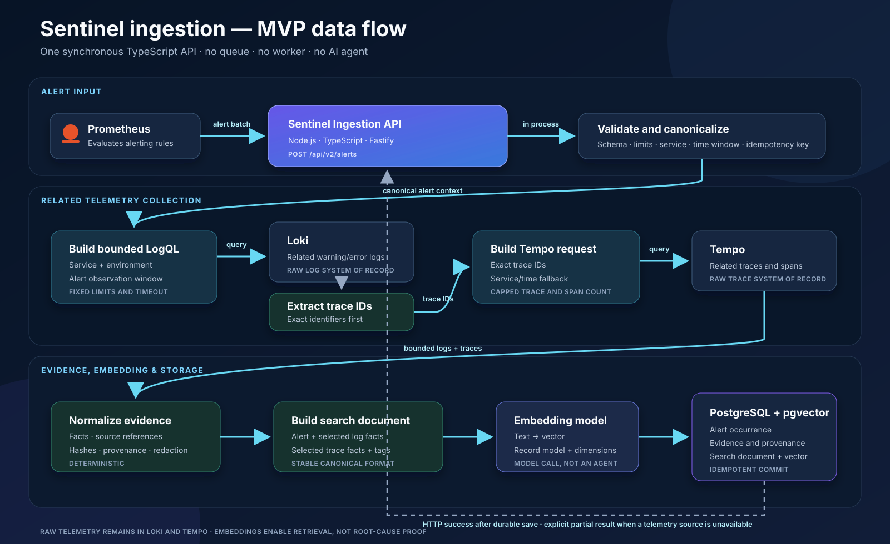
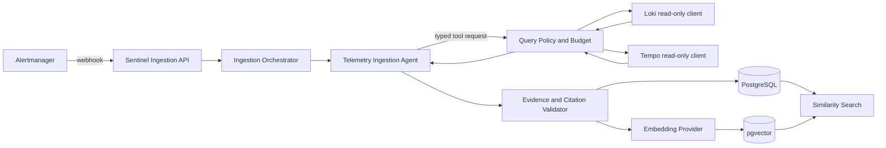
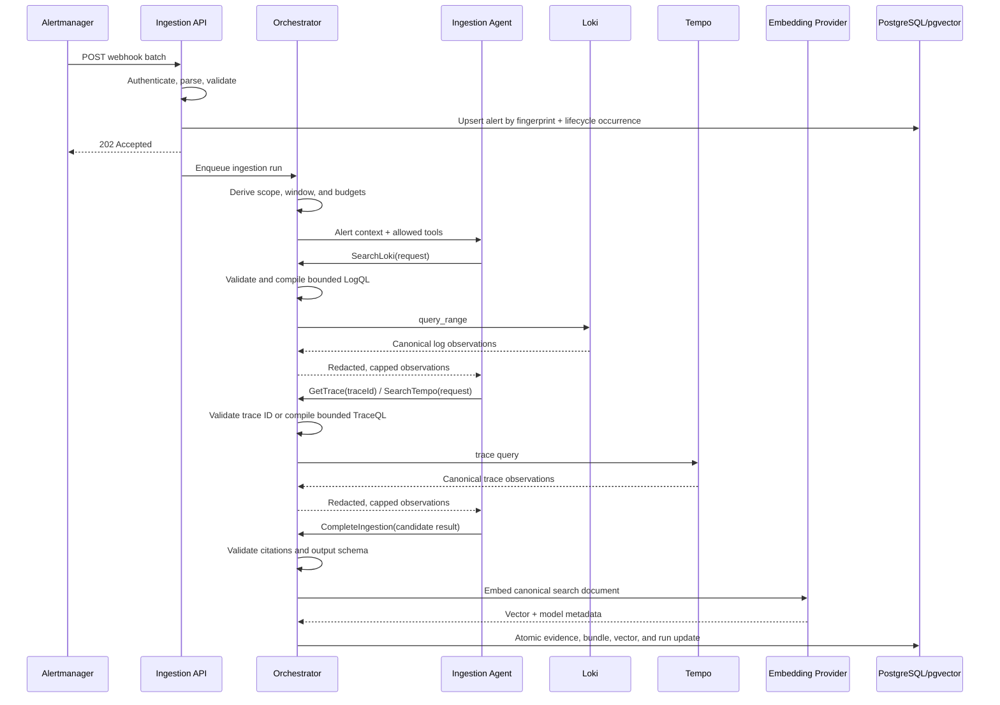
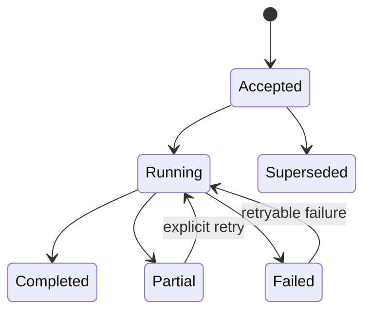

# AI-Assisted Telemetry Ingestion — System Design

## 1. Purpose

The ingestion subsystem turns a Prometheus Alertmanager notification into a
durable, provenance-preserving, semantically searchable evidence bundle.

For each alert, Sentinel:

1. accepts and validates the Alertmanager webhook;
2. identifies the affected service and a bounded observation window;
3. collects related logs from Loki and traces from Tempo;
4. uses a bounded AI agent to select and correlate relevant telemetry;
5. validates every agent citation against collected source data;
6. persists structured evidence and a compact embedding document; and
7. exposes similarity search for future alerts and incidents.

This component performs collection and indexing. Root-cause investigation,
hypothesis generation, report writing, and remediation are downstream concerns.

## 2. Goals and non-goals

### Goals

- Accept Alertmanager webhook batches and process each alert independently.
- Remain idempotent when Alertmanager retries a notification.
- Correlate by service, environment, time, trace ID, span ID, and resource labels.
- Query Loki and Tempo through read-only, bounded application tools.
- Preserve the original alert and exact query/source provenance.
- Store normalized evidence relationally in PostgreSQL.
- Store compact search documents and embeddings in pgvector.
- Return partial, explicit results when a telemetry source or model is unavailable.
- Support similarity search across previous evidence bundles.

### Non-goals

- Letting a model issue arbitrary LogQL, TraceQL, SQL, or HTTP requests.
- Copying complete Loki streams or Tempo traces into PostgreSQL.
- Treating similarity as proof of root cause.
- Autonomous remediation or mutation of external systems.
- Performing full incident investigation inside the ingestion request.

## 3. Context and boundaries

The current queue-free MVP flow is shown below. It uses one synchronous
TypeScript/Fastify API and a direct embedding call; it does not contain an AI
agent or background worker.



The remainder of this document describes the later AI-assisted target design.
Its agent, durable work queue, and independently deployed worker are post-MVP
options rather than requirements for the first ingestion implementation.



Alertmanager is the trigger. Prometheus remains the metric and alert-rule
source; Alertmanager is responsible for delivering firing and resolved webhook
notifications.

Loki and Tempo remain the systems of record for raw telemetry. Sentinel stores
selected facts, immutable source references, hashes, correlation metadata,
summaries, and embeddings.

## 4. Design principles

1. **Deterministic shell, agentic core.** Trusted code owns validation, query
   execution, limits, retries, and persistence. The agent chooses among typed
   read-only tools and explains relevance.
2. **Evidence before embeddings.** An embedding is generated only from evidence
   that passed source and citation validation.
3. **Bounded collection.** Every run has fixed time, query, result, byte, and
   token limits.
4. **Provenance by construction.** Every fact points to the source system,
   query, time range, resource identity, and immutable identifiers available.
5. **Idempotent at every boundary.** Webhook retries and repeated source queries
   do not create duplicate alerts, evidence, or bundles.
6. **Partial results are valid.** A Loki, Tempo, or model failure is recorded;
   successfully validated evidence is not misrepresented as a complete view.
7. **Telemetry is untrusted input.** Log bodies, span attributes, and alert
   annotations are data, never instructions to the agent.

## 5. High-level processing flow



The webhook returns after durable acceptance, not after AI processing. This
keeps Alertmanager delivery reliable and separates webhook retries from model
or telemetry-source latency.

## 6. API design

### 6.1 Receive Alertmanager notifications

```http
POST /api/ingestion/alertmanager
Content-Type: application/json
```

The endpoint accepts the Alertmanager webhook schema, including `status`,
`groupKey`, `commonLabels`, `commonAnnotations`, and `alerts[]`.

Required behavior:

- authenticate the sender using a shared secret or trusted network identity;
- enforce request-size and alert-count limits;
- validate timestamps and required routing labels;
- calculate an occurrence key for each alert;
- durably record accepted alerts in one short transaction;
- return `202 Accepted` with accepted, duplicate, and rejected counts; and
- schedule one ingestion run per accepted alert.

Suggested response:

```json
{
  "batchId": "7bd51a0d-544a-49c4-9f65-37bdb24e3700",
  "accepted": 1,
  "duplicates": 0,
  "rejected": 0
}
```

### 6.2 Retrieve ingestion status

```http
GET /api/ingestion/runs/{runId}
```

Returns state, source outcomes, budgets consumed, evidence counts, embedding
status, and failure codes. It must not return secrets or unrestricted raw
telemetry.

### 6.3 Find similar evidence bundles

```http
POST /api/evidence/search/similar
```

```json
{
  "text": "checkout latency caused by payment dependency timeouts",
  "service": "incidentlab-order-api",
  "environment": "development",
  "limit": 10,
  "minimumSimilarity": 0.72
}
```

Results include similarity, bundle summary, tags, time, service, evidence
references, and embedding model/version. Similarity is a retrieval score, not a
confidence score or causal conclusion.

## 7. Alert identity and idempotency

Alertmanager's `fingerprint` identifies an alert label set, but the same alert
can fire again later. Sentinel therefore uses two identities:

- **Alert definition identity:** Alertmanager fingerprint.
- **Alert occurrence identity:** SHA-256 of fingerprint, normalized `startsAt`,
  receiver/tenant, and environment.

`resolved` notifications update the matching occurrence. They do not create a
new evidence bundle unless policy explicitly requests a closing collection
window.

The database enforces unique occurrence keys. Evidence continues to use its
deterministic content hash and source identifiers. An ingestion run has an
idempotency key derived from occurrence ID plus ingestion policy version.

## 8. Correlation scope

### 8.1 Canonical alert context

Trusted code maps configured Alertmanager labels into a canonical context:

```text
AlertName, Fingerprint, Status, StartsAt, EndsAt
Service, Environment, Namespace, Cluster, Workload, Pod
Severity, Instance, Job, Region, Tenant
GeneratorUrl, DashboardUrl, RunbookUrl
```

Label aliases are configuration, for example `service`, `service_name`, and
`service.name` may map to `Service`. A missing service label causes explicit
degraded processing; the agent must not guess an unrestricted service scope.

### 8.2 Time window

The default firing window is:

```text
[startsAt - 10 minutes, evaluation time + 5 minutes]
```

Configuration sets hard minimum and maximum widths. The agent may narrow this
window but cannot expand it beyond policy. A resolved-alert closing run may use
a small window around `endsAt`.

### 8.3 Correlation order

1. Exact trace IDs present in alert labels or annotations.
2. Exact trace IDs extracted deterministically from in-scope Loki observations.
3. Service, environment, namespace, workload, and time-window matches.
4. Error status, duration, operation, route, and resource-attribute matches.
5. Agent-ranked relevance among already bounded candidates.

Exact identifiers outrank semantic similarity. Embeddings are not used to
decide whether raw telemetry belongs to the current alert.

## 9. Agent design

### 9.1 Responsibility

`TelemetryIngestionAgent` receives canonical alert context and capped tool
results. It selects useful searches, correlates observations, and proposes a
structured evidence bundle.

It does not receive credentials, construct unrestricted backend requests,
write to the database, or invoke arbitrary network endpoints.

### 9.2 Allowed tools

```text
SearchLoki(LogSearchRequest)
SearchTempo(TraceSearchRequest)
GetTrace(TraceIdRequest)
CompleteIngestion(IngestionProposal)
```

Tool requests use semantic fields rather than raw query languages:

```json
{
  "service": "incidentlab-order-api",
  "environment": "development",
  "start": "2026-08-07T14:20:00Z",
  "end": "2026-08-07T14:35:00Z",
  "minimumSeverity": "Warning",
  "terms": ["timeout", "504"],
  "limit": 100
}
```

The application compiles this request into allowlisted LogQL or TraceQL. It
rejects label-scope changes, excessive windows, unknown fields, query-language
fragments in text fields, and limits above policy.

### 9.3 Initial budgets

Recommended MVP defaults:

| Budget | Default | Hard limit |
| --- | ---: | ---: |
| Agent turns | 4 | 6 |
| Loki searches | 2 | 3 |
| Tempo searches | 2 | 3 |
| Trace retrievals | 10 | 20 |
| Log observations returned to agent | 100 | 250 |
| Trace spans returned to agent | 250 | 500 |
| Collection window | 15 minutes | 60 minutes |
| Wall-clock processing | 45 seconds | 90 seconds |

Budgets are enforced outside the model and recorded on the ingestion run.

### 9.4 Structured output

```json
{
  "summary": "Checkout requests returned 504 while the payment dependency timed out.",
  "tags": ["checkout", "payment", "timeout", "http-504"],
  "selectedEvidence": [
    {
      "observationId": "obs_01",
      "relevance": "The server span ended with HTTP 504 inside the alert window."
    }
  ],
  "relationships": [
    {
      "sourceObservationId": "obs_01",
      "targetObservationId": "obs_02",
      "kind": "Corroborates",
      "rationale": "The log and span share the same trace ID."
    }
  ],
  "searchDocument": "Service: incidentlab-order-api\nAlert: High latency...",
  "completionReason": "SufficientCorrelatedEvidence"
}
```

The validator rejects unknown observation IDs, cross-tenant references,
unsupported relationship kinds, excessive text, missing provenance, and claims
that cannot be tied to selected evidence. Model and prompt versions are always
added by trusted code, never accepted from model output.

### 9.5 Prompt-injection boundary

The system prompt states that telemetry content is untrusted evidence. Tool
results place log bodies, span attributes, and alert annotations in explicitly
delimited data fields. Strings resembling instructions do not change tool
permissions or query scope. Output remains subject to citation validation.

## 10. Application components

The proposed .NET boundaries fit the existing modular monolith:

```text
Sentinel.Api
  AlertIngestionEndpoints
  Alertmanager contracts and validation

Sentinel.Application
  Ingestion/AcceptAlertBatchUseCase
  Ingestion/RunTelemetryIngestionUseCase
  Ingestion/TelemetryIngestionAgent
  Ingestion/IngestionProposalValidator
  Ingestion/IIngestionRepository
  Ingestion/IIngestionQueue
  Search/FindSimilarEvidenceUseCase
  AI/IEmbeddingClient

Sentinel.Domain
  Ingestion/AlertOccurrence
  Ingestion/IngestionRun
  Ingestion/EvidenceBundle
  Ingestion/IngestionStatus

Sentinel.Infrastructure
  Observability/LokiLogSource
  Observability/TempoTraceSource
  Persistence/PostgresIngestionRepository
  AI/OpenAiEmbeddingClient
  AI/OllamaEmbeddingClient
  Background/IngestionWorker
```

Existing Loki and Tempo adapters should be reused behind narrower ingestion
tool handlers. Existing deterministic evidence normalizers remain authoritative
for persisted Evidence creation.

## 11. Persistence design

### 11.1 `alert_occurrences`

| Column | Purpose |
| --- | --- |
| `id` | Sentinel occurrence ID |
| `occurrence_key` | Unique idempotency hash |
| `fingerprint` | Alertmanager fingerprint |
| `status` | Firing or resolved |
| `starts_at`, `ends_at` | Alert lifecycle |
| `service`, `environment`, `tenant_id` | Canonical scope |
| `labels_json`, `annotations_json` | Validated original context |
| `payload_hash` | Audit and duplicate detection |
| `received_at`, `resolved_at` | Delivery lifecycle |

### 11.2 `ingestion_runs`

| Column | Purpose |
| --- | --- |
| `id`, `alert_occurrence_id` | Run identity and parent |
| `policy_version` | Reproducible limits and mappings |
| `status` | Accepted, Running, Completed, Partial, Failed |
| `window_start`, `window_end` | Enforced collection bounds |
| `model`, `prompt_version` | Agent audit metadata |
| `tool_calls`, `tokens`, `duration_ms` | Budget accounting |
| `loki_status`, `tempo_status`, `embedding_status` | Partial-result detail |
| `failure_code`, `failure_detail` | Sanitized terminal error |
| `started_at`, `completed_at` | Run timing |

A unique index on `(alert_occurrence_id, policy_version)` prevents duplicate
default runs. Explicit reprocessing uses a new policy version or attempt key.

### 11.3 Existing `evidence`

Continue storing one normalized fact per Evidence row. Add `ingestion_run_id` or
an association table so provenance can identify the collection run without
changing Evidence identity. Source references point back to Loki or Tempo; raw
payloads are retained only when a bounded audit requirement justifies it.

### 11.4 `evidence_bundles`

| Column | Purpose |
| --- | --- |
| `id`, `ingestion_run_id`, `alert_occurrence_id` | Bundle identity |
| `incident_id` | Optional later association |
| `summary` | Validated compact summary |
| `search_document` | Canonical text used for embedding |
| `tags` | Normalized retrieval facets |
| `content_hash` | Idempotency across regeneration |
| `embedding` | pgvector column |
| `embedding_model`, `embedding_dimensions` | Vector compatibility |
| `embedding_created_at` | Index lifecycle |

Use one configured embedding dimension per indexed column. A model migration
should write to a new vector column/table or rebuild the index; vectors from
different models must not be compared as if they share one space.

### 11.5 Bundle membership

`evidence_bundle_items(bundle_id, evidence_id, relevance, ordinal)` records the
validated Evidence rows selected for the bundle. Foreign keys ensure that an
agent cannot cite nonexistent evidence.

### 11.6 Vector index

Start with exact cosine-distance search while the corpus is small. Add an HNSW
cosine index only after measuring corpus size and query latency. Similarity
queries must filter by embedding model and tenant before ordering by distance;
service and environment are optional retrieval filters.

## 12. Search-document construction

Trusted code constructs the final embedding text from validated fields in a
stable order:

```text
Alert: <name and normalized symptom>
Service: <service>
Environment: <environment>
Window: <bounded timestamps>
Summary: <validated agent summary>
Signals:
- <evidence type>: <factual Evidence summary>
Errors: <normalized error signatures>
Operations: <routes and span names>
Tags: <sorted normalized tags>
```

Do not embed IDs, URLs, volatile timestamps, stack-trace line numbers, or large
raw log bodies unless they carry semantic value. Preserve those fields in the
relational provenance instead. Redaction happens before model and embedding
calls.

## 13. State model and failures



- `Completed`: required sources were queried, proposal validated, bundle stored,
  and embedding created.
- `Partial`: at least one useful evidence item was stored, but a source, agent,
  or embedding stage failed.
- `Failed`: no valid evidence bundle could be committed.
- `Superseded`: a queued occurrence was replaced or resolved according to
  policy before processing began.

Retries use exponential backoff with jitter for source and provider timeouts.
Validation failures are not retried with the identical prompt and input.
Embedding failure does not discard relational evidence; a separate retry can
complete indexing later.

## 14. Security and privacy

- Authenticate Alertmanager and authorize its tenant/environment scope.
- Use read-only Loki and Tempo credentials with tenant isolation.
- Do not expose backend query languages through the public API or agent tools.
- Redact configured secrets, tokens, email addresses, and customer identifiers
  before sending content to any model provider.
- Encrypt provider credentials through deployment secret management.
- Store hashes for audit payloads when full payload retention is unnecessary.
- Log tool metadata and counts, not raw sensitive telemetry.
- Apply retention independently to alert payloads, evidence, and embeddings.
- Treat generator, dashboard, runbook, log, and trace URLs as untrusted links.

## 15. Observability

Each accepted alert creates an ingestion correlation ID. Propagate it through
background processing and model/tool calls.

Recommended metrics:

- `sentinel_ingestion_alerts_total{outcome}`
- `sentinel_ingestion_runs_total{status}`
- `sentinel_ingestion_duration_seconds`
- `sentinel_ingestion_tool_calls_total{tool,outcome}`
- `sentinel_ingestion_observations_total{source,selected}`
- `sentinel_ingestion_budget_exhaustions_total{budget}`
- `sentinel_embedding_requests_total{model,outcome}`
- `sentinel_similarity_search_duration_seconds`

Traces should distinguish webhook acceptance, queue delay, source queries,
agent turns, validation, embedding, and persistence. Logs include IDs and
failure codes but exclude raw telemetry and prompts by default.

## 16. Deployment and execution model

For the MVP, the Sentinel API can host a bounded background worker backed by a
PostgreSQL outbox/work table. The webhook transaction inserts both the alert
occurrence and pending work item. Workers claim rows using `FOR UPDATE SKIP
LOCKED`, allowing safe horizontal processing later.

An in-memory queue alone is insufficient because an API restart after returning
`202 Accepted` would lose work. A separate broker is unnecessary for the first
version unless measured load or operational requirements justify it.

## 17. Verification strategy

### Unit tests

- Alertmanager payload validation and label canonicalization.
- Occurrence-key stability and lifecycle behavior.
- Query-policy enforcement and budget exhaustion.
- Trace-ID extraction and exact correlation.
- Agent output schema and citation validation.
- Stable search-document construction and content hashing.
- Similarity filtering by model, tenant, service, and environment.

### Adapter tests

- Loki request compilation and malformed-response handling.
- Tempo search and trace retrieval with capped results.
- Embedding dimension and provider-response validation.
- pgvector round trip and cosine ordering.

### End-to-end acceptance scenario

```text
Start Incident Lab dependency-timeout scenario
→ Prometheus rule fires
→ Alertmanager sends a webhook
→ Sentinel accepts one alert occurrence
→ ingestion agent performs bounded Loki and Tempo collection
→ selected logs and spans are normalized into Evidence
→ every proposed citation resolves to stored Evidence
→ one evidence bundle and embedding are persisted
→ retry the same webhook and create no duplicates
→ submit a semantically similar query
→ retrieve the evidence bundle with resolvable source references
```

Also verify Loki unavailable, Tempo unavailable, model unavailable, invalid
agent citation, embedding unavailable, API restart after acceptance, and alert
resolution during queued processing.

## 18. Delivery sequence

### Slice 1 — Durable alert intake

- Alertmanager webhook contract and authentication.
- Canonical labels and occurrence identity.
- `alert_occurrences`, `ingestion_runs`, and durable work queue.
- Status endpoint and idempotency tests.

### Slice 2 — Deterministic correlated collection

- Fixed service/time-window Loki query.
- Deterministic trace-ID extraction from collected logs.
- Tempo trace retrieval by exact ID.
- Existing Evidence normalizers and repositories.
- Partial-source outcomes and end-to-end test without AI.

### Slice 3 — Bounded ingestion agent

- Typed tool contracts and query-policy compiler.
- Tool-call, result, time, and token budgets.
- Structured completion proposal and citation validator.
- OpenAI/Ollama provider integration through existing abstractions.

### Slice 4 — Embeddings and similarity search

- `evidence_bundles` and membership schema.
- Embedding client abstraction and provider adapters.
- Redaction and canonical search-document builder.
- pgvector persistence and similarity endpoint.
- Model-version isolation and embedding retry.

### Slice 5 — Operational hardening

- Alert lifecycle and resolved-notification policy.
- Load, retry, restart, and degraded-source verification.
- Dashboards, budgets, retention, and runbook.

## 19. Decisions to preserve

- Alert intake is durable before asynchronous processing begins.
- The agent chooses only among typed, read-only, policy-constrained tools.
- Trusted code compiles and executes Loki and Tempo queries.
- All persisted AI-selected facts cite collected, validated Evidence IDs.
- Raw telemetry stays in Loki and Tempo.
- Relational evidence remains useful when AI or embeddings are unavailable.
- Embedding vectors are model-versioned and used for retrieval, not causality.
- Investigation and root-cause analysis remain downstream of ingestion.

## 20. Immediate implementation action

Implement Slice 1 and define the Slice 2 tool-neutral collection contract.
The first demonstrable checkpoint is a retried Alertmanager firing notification
that creates exactly one durable alert occurrence and one pending ingestion run,
with a canonical service and bounded collection window.
